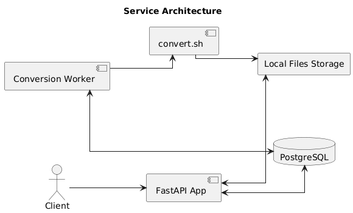

# FileConverter

**FileConverter** is a Python-based web service for converting special 
files from one format (.mfile) to another (.pdfx, .jsonl, .binx).

## Architecture


### File Upload
A client uploads a file via the FastAPI API. The file is stored locally, and the service returns a unique file ID.

### Conversion Scheduling
Using the received file ID, the client schedules a conversion task through another FastAPI endpoint. This creates a conversion record in the database with status set to pending.

### Conversion Worker
A background worker periodically checks the database for pending conversions. For each one:

 - It executes the `convert.sh` script, which simulates the conversion process.

 - The script saves the converted file to the local storage.

 - The conversion record in the database is updated to completed (or failed if an error occurs).

### Status Polling
The client can poll the conversion status using its conversion ID through the server API

## Development
### Requirements

- Python 3.12
- PostgreSQL

### Setup for local development
- Create and activate virtual environment:
```bash
  make venv
  source .venv/bin/activate
```

- Copy the environment configuration from the template:
```bash
  cp .env.tmpl .env
```

- Edit the .env file, for example:
```bash
  DB_USER=user
  DB_PASSWORD=password
  DB_HOST=localhost
```

- Create the `converter` database in PostgreSQL, for example:
```bash
  psql -U postgres -c "CREATE DATABASE converter;"
```

- Run database migrations:
```bash
  make upgrade_db
```

### Running the app locally
> Make sure your environment variables from the `.env` file are loaded before starting the services.  
> You can do this by using a tool like `python-dotenv`, which is already installed in local venv
> or by exporting them manually in your shell.

 - Start FastAPI server (using `python-dotenv` cli):
```bash
  dotenv -f .env run python manage.py runserver
```

 - Start `conversion` worker (using `python-dotenv` cli):
```bash
  dotenv -f .env run python manage.py runworker conversion
```

### Api Documentation
Once the FastAPI server is running, you can explore the interactive API docs by navigating to:

- Swagger UI: http://localhost:8000/docs

- ReDoc: http://localhost:8000/redoc

The service exposes a documented REST API defined using the [OpenAPI Specification](https://swagger.io/specification/).
The schema can be found here:
- [openapi.json](docs/openapi.json)

## Deployment plan
### Cloud provider
The service is designed to be deployed as containerized applications, making it compatible
with any cloud provider that supports containerized workloads. The options can be narrowed to
Amazon Web Services (AWS) and Google Cloud Platform (GCP), as they are the most popular cloud
platforms offering robust support for containers, managing databases and object storage.

The following table outline how each component can be deployed:

| Component   | AWS                     | GCP                        |
|-------------|-------------------------|----------------------------|
| FastAPI app | ECS Fargate + ALB       | Cloud Run                  |
| Worker      | ECS Fargate             | Cloud Run                  |
| Storage     | S3 bucket               | Cloud Storage bucket (GCS) |
| Database    | Amazon RDS (PostgreSQL) | Cloud SQL (PostgreSQL)     |
| Monitoring  | CloudWatch              | Cloud Monitoring           |

### Deployment flow
1. Build Docker images for FastAPI app and worker
2. Push images to AWS ECR / Google Artifact Registry
3. Define ECS task definitions / Deploy services to Cloud Run
4. Setup S3 bucket / Cloud Storage bucket
5. Create RDS instance / Cloud SQL instance
6. Setup CloudWatch to collect logs and metrics / Setup Cloud Logging + Cloud Monitoring

### Scaling strategy
#### FastAPI app
- **Trigger**: CPU utilization
- **Reason**: As traffic increases, CPU usage typically rises because the server is handling a greater
number of requests

#### Conversion worker
- **Trigger**: CPU utilization or number of pending conversions in the database
- **Reason**: The worker executes file conversion which is typically CPU-bound intensive. Monitoring the number
of pending conversions helps scale based on actual workload.

## Potential improvements
The current service implementation works well for basic file conversions, but several improvements can make
it more scalable, secure and reliable:
1. **Cloud-Based File Storage**

   Replace local file storage with integration to Amazon S3, Google Cloud Storage, or another object store. 
   This allows the service to be fully stateless and better suited for distributed or containerized deployments.
2. **Queue-Based Worker Architecture**

   Refactor the worker to consume jobs from a message queue (e.g., RabbitMQ, AWS SQS, or Google Pub/Sub) instead of 
   using database polling. This enables on-demand processing and more efficient resource use.
3. **Authentication and User Management**

   Add user accounts, authentication (e.g., via JWT, OAuth2), and authorization to support multi-user environments, 
   rate limits, and data isolation. This would also allow tracking conversions per user and enforcing usage policies.